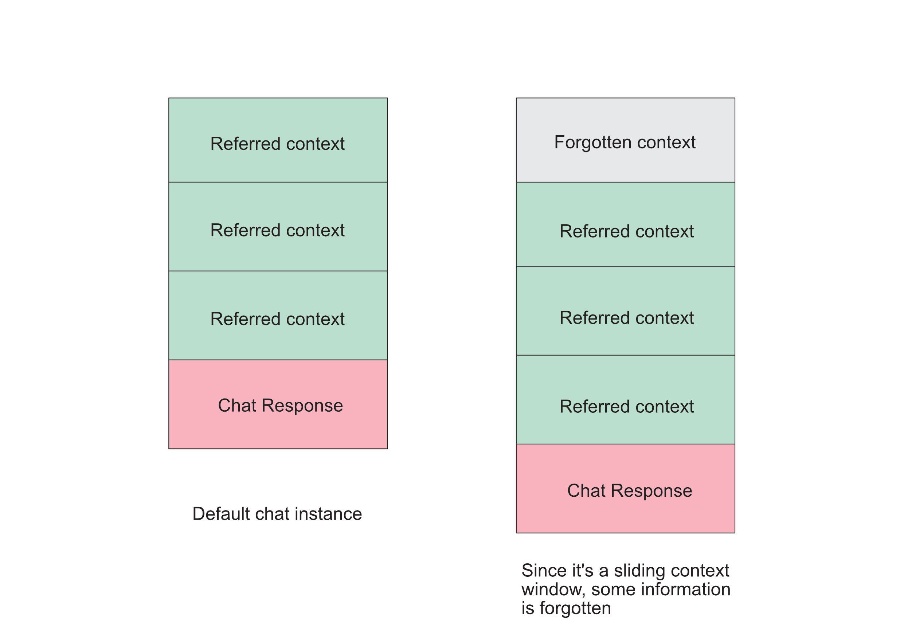
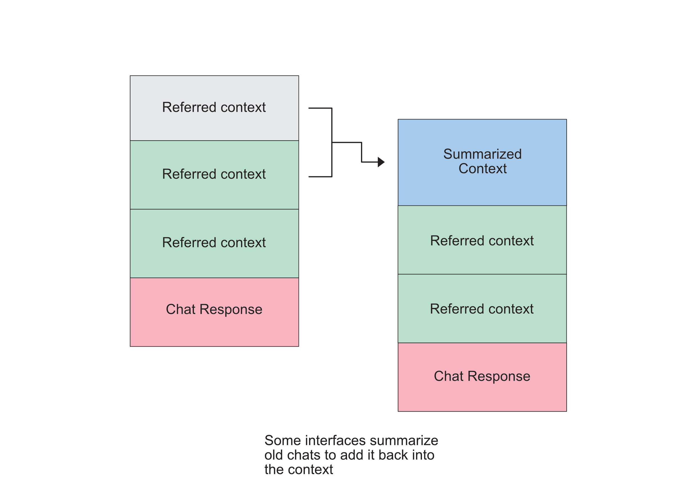
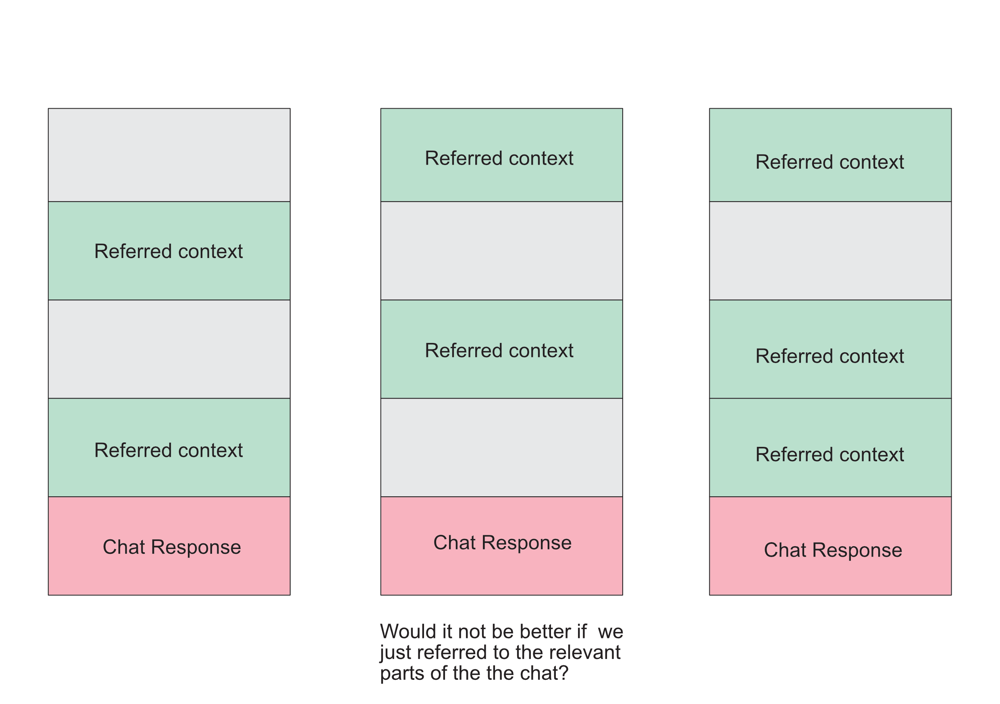
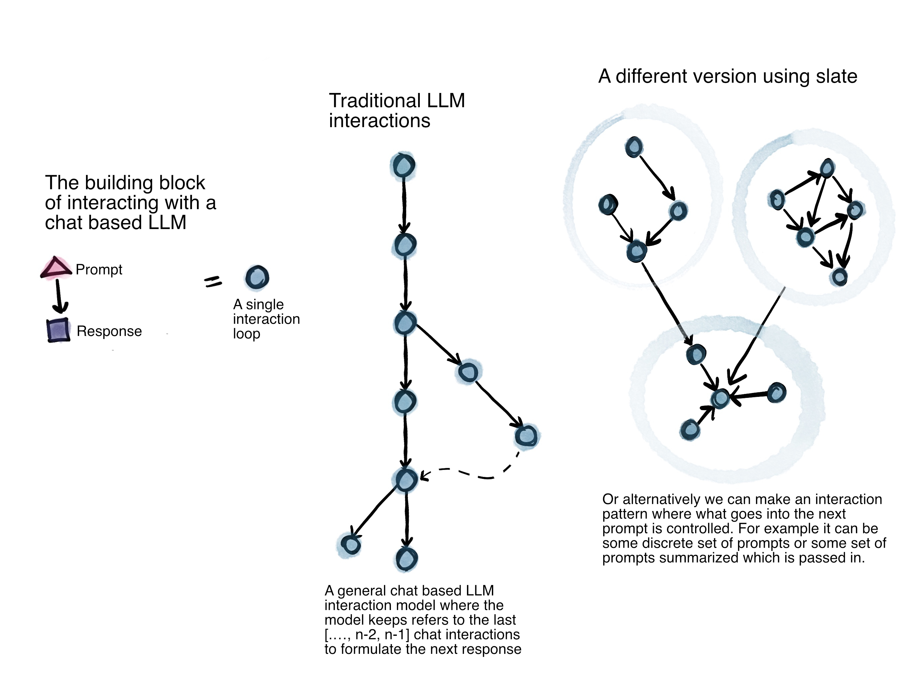

# Why Slate Exists

## The Problem with Current LLM Interfaces

Most LLM chat interfaces present a fundamental lie: they pretend the LLM "remembers" your conversation. But the truth is, **LLMs are stateless machines**. You give them input, they return output. They have no memory of what came before.

To create the illusion of memory, interfaces use a **sliding context window** - they maintain the last N chat exchanges and feed them back to the model with each new request. This works... until it doesn't.

### The Sliding Window Problem

When your conversation exceeds the context length, the model starts forgetting. The oldest parts of your conversation get pushed out of the window, and the LLM loses track of earlier context. This creates a frustrating experience where the LLM"forgets" important information you discussed earlier.

### The Summarization "Solution"

Some interfaces try to solve this by summarizing old chat history and appending it back into the context. This helps preserve some information, but it's still a workaround. The LLM is still operating on a limited, processed view of the conversation.

## A Better Approach: User-Controlled Context

**Why are we lying about LLM interfaces?**

Instead of pretending the LLM has memory, why not be honest? Let users **pick and choose** which parts of the generated text they want to provide as context for the next generation.

This is exactly what Slate does.

## A different visualization 

The above is an alternate visualization. If we imagine each pair of prompt and response events as a node A chat like interface almost encourages a user to stay in one linear lane of questioning and exploration. The ways to fix this has in the past been to show the user some version of the sliding window as discussed above or a vector database - where the user no longer has access to the data locally. 

### How Slate Works

1. **Cards as Context Units**: Each LLM response is saved as a card - a discrete, reusable piece of content.

2. **Explicit References**: Use `@card_title` to explicitly reference which cards should be included as context.

3. **No Hidden State**: Everything is transparent. You see exactly what context is being sent to the AI.

4. **Persistent Knowledge**: Cards persist across sessions. Your knowledge graph grows over time, not lost in a sliding window.

5. **Selective Context**: You choose what's relevant. Not the last N messages, but the specific cards that matter for your current task.

### The Benefits

- **No Forgetting**: Important information is preserved in cards, not lost in a sliding window
- **Explicit Control**: You decide what context matters, not an arbitrary window size
- **Reusable Knowledge**: Cards can be referenced across different conversations and documents
- **Transparency**: You see exactly what context is being sent to the AI
- **Scalability**: Your knowledge graph can grow indefinitely without hitting context limits
- **Privacy**: The alternative is a vector database where a user's data is stored online somewhere and the user does not have control over the data locally.

## The Philosophy

Slate rejects the illusion of LLM memory. Instead, it embraces the stateless nature of LLMs and gives you the tools to build your own persistent knowledge structure. 

This isn't just a different interface - it's a fundamentally different way of thinking about AI-assisted knowledge work.

---

## Try Slate

**Live Demo**: [https://range-et.github.io/slate/](https://range-et.github.io/slate/)

- **[README](README.md)** - Feature overview, usage guide, and getting started instructions
- **[Deployment Guide](DEPLOYMENT.md)** - Instructions for deploying Slate as a static site

